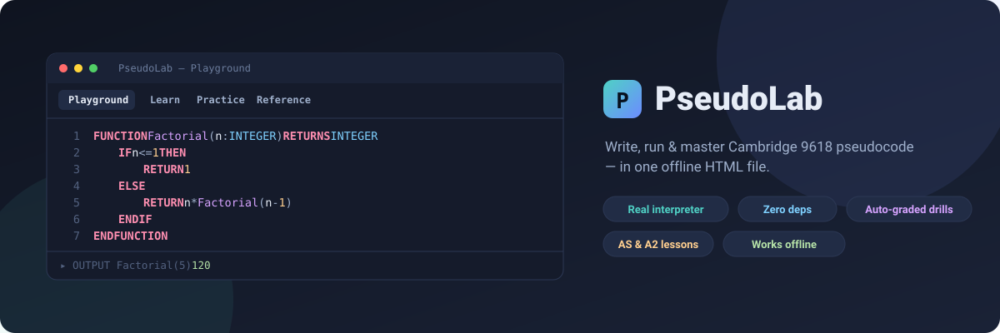

<!-- Replace mikezzx2009 with your GitHub username and pseudolab.tech with your domain -->

<p align="center">
  
</p>

<h1 align="center">PseudoLab</h1>

<p align="center">
  <b>A single‑file web editor, runner and trainer for Cambridge International AS &amp; A Level (9618) pseudocode.</b><br>
  Write pseudocode, <b>actually run it</b>, learn every AS/A2 topic, and drill auto‑graded practice questions — all offline, in one HTML file.
</p>

<p align="center">
  <a href="https://github.com/mikezzx2009/pseudolab/stargazers"></a>
  
  
  
  
</p>

<p align="center">
  <a href="https://pseudolab.tech"><b>🔗 Live demo</b></a> &nbsp;·&nbsp;
  <a href="#-quick-start">Quick start</a> &nbsp;·&nbsp;
  <a href="DEPLOY.md">Deploy your own</a>
</p>

---

## ✨ What it does

PseudoLab turns the official Cambridge pseudocode (used in 9618 exam papers) into something you can **edit and run**, not just read.

| | |
|---|---|
| 🖊️ **Playground** | A syntax‑highlighting editor with line numbers and a real built‑in interpreter. An interactive **console** shows output and lets you type answers to `INPUT` inline, just like a terminal. Create virtual files (with a **+ New file** manager) for file‑handling programs. `Ctrl/⌘ + Enter` to run. |
| 📚 **Learn** | 29 lessons grouped by **AS** and **A2**, each with clear notes, exam tips, the exact 9618 syntax, and a runnable example you can open in the Playground in one click. |
| ✅ **Practice** | Original exam‑style questions by topic. Hit **Check answer** and your code is run against hidden test cases — instant pass/fail with the first failing case shown. Solved questions are ticked and your work is saved. |
| 📖 **Reference** | A one‑page cheat‑sheet of every keyword, operator and built‑in function. |

The interpreter is **not** a regex hack — it's a proper lexer + recursive‑descent parser + tree‑walking evaluator that runs the full 9618 feature set.

## 🎯 Syllabus coverage

Topics follow the Cambridge AS &amp; A Level Computer Science coursebook.

- **AS** — computational thinking &amp; algorithm design; variables, data types, operators; selection (`IF`/`CASE`); iteration (`FOR`/`WHILE`/`REPEAT`); standard algorithms &amp; trace tables; 1‑D &amp; 2‑D arrays; linear search &amp; bubble sort; records; text files; procedures &amp; functions; parameter passing (`BYVAL`/`BYREF`); built‑in &amp; string functions.
- **A2** — recursion; binary search; insertion sort; Big O; abstract data types (stack, queue, linked list, binary tree, hash table / dictionary); random files &amp; exception handling; object‑oriented programming (classes, encapsulation, inheritance, polymorphism); programming paradigms.

## 🧠 Interpreter features

Data types · constants · `←` assignment · arithmetic incl. `DIV`/`MOD` · relational &amp; logic operators · 1‑D/2‑D arrays · 1‑based string indexing `s[i]` · `IF`/`CASE` (with ranges &amp; `OTHERWISE`) · `FOR`/`WHILE`/`REPEAT` · procedures &amp; functions · `BYREF`/`BYVAL` · **recursion** · records · enumerated types · text &amp; random files · classes, constructors, inheritance, `SUPER` · string/numeric built‑ins (`LENGTH`, `LEFT`, `RIGHT`, `MID`, `UCASE`, `LCASE`, `ASC`, `CHR`, `INT`, `STRING_TO_NUM`, …). Infinite‑loop protection and friendly, line‑numbered error messages included.

## 🚀 Quick start

**Just use it:** open the live demo, or download [`index.html`](index.html) and double‑click it. No server, no install, no internet required.

**Run from source / hack on it:**

```bash
git clone https://github.com/mikezzx2009/pseudolab.git
cd pseudolab
# edit lessons/questions in src/content.js or the engine in src/engine.js, then:
node build.js          # inlines src/* into the single index.html
npm test               # 79 interpreter tests + content verification
```

## 🗂️ Project structure

```
index.html          the website (open this) — everything inlined, fully offline
src/engine.js       the pseudocode interpreter (lexer + parser + evaluator)
src/content.js      all lessons + practice questions
src/app.js          UI (editor widget, runner, autograder, views)
src/styles.css      styling (dark + light themes)
src/template.html   HTML shell with placeholders
build.js            inlines src/* into index.html
test/               Node tests (engine, content, headless‑DOM UI)
.github/workflows/  auto‑build &amp; deploy to GitHub Pages
```

Everything ships inlined in `index.html`, but the `src/` files are the real source — edit those and run `node build.js`.

## ➕ Adding practice questions

Questions live in `src/content.js`:

```js
{
  id: 'q-as-9', level: 'AS', topic: 'Searching',
  title: 'Your title',
  prompt: '<p>Question text (HTML).</p>',
  starter: 'DECLARE ...\n',                 // code the learner starts from
  solution: 'DECLARE ...\n',                // model answer (also used to grade)
  tests: [ { stdin: ['4','9'] }, { stdin: ['0'] } ],
  append: '\nINPUT x\nOUTPUT f(x)',         // optional harness for "write a function" tasks
  hint: 'A short hint.'
}
```

Grading runs **your model solution** and the **learner's code** on the same inputs and compares output — so you never hand‑write expected strings, just provide good `stdin` cases. Run `npm test` to verify every example and solution still executes.

## 🤝 Contributing

PRs welcome — new lessons, more practice questions, interpreter fixes. Please run `npm test` (and optionally `npm run test:ui`) before opening a PR.

## 📜 License

[MIT](LICENSE) © 2026 Mike

## 🙏 Acknowledgements &amp; disclaimer

Built around the Cambridge International AS &amp; A Level Computer Science (9618) pseudocode conventions. **This is an independent study tool and is not affiliated with, endorsed by, or sponsored by Cambridge Assessment International Education.** Practice questions are original and written in the style of exam questions; no copyrighted past‑paper text is reproduced.
